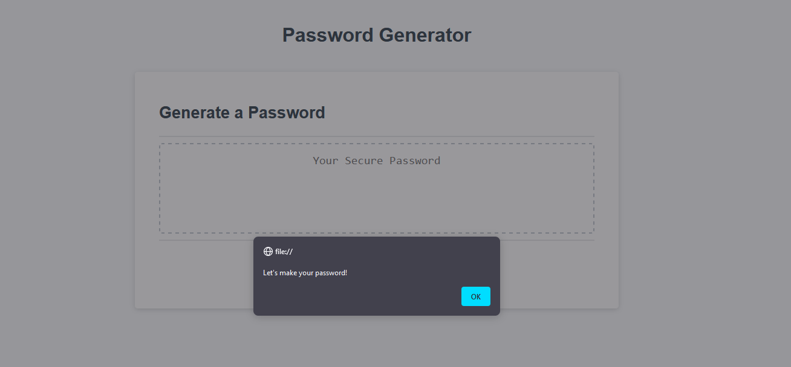

# password-generator

## Description

This project generates strings of random characters to be used as passwords. Passwords are required to keep your most sensitive information safe, and by using passwords that are randomly generated, you increase your security. While making this project I learned about string functions and window popups.

## Installation

https://jubernst.github.io/password-generator/

## Usage

Click "Generate Password" and follow the popup instructions.

## Credits

Made with help from the tutorial: https://www.youtube.com/watch?v=x4HUaiazDes&t=652s

## License

The last section of a high-quality README file is the license. This lets other developers know what they can and cannot do with your project. If you need help choosing a license, refer to [https://choosealicense.com/](https://choosealicense.com/).